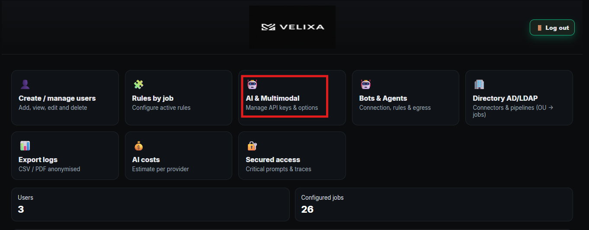
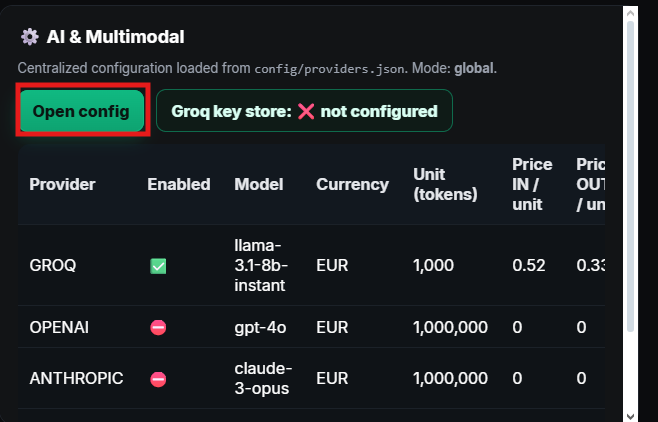
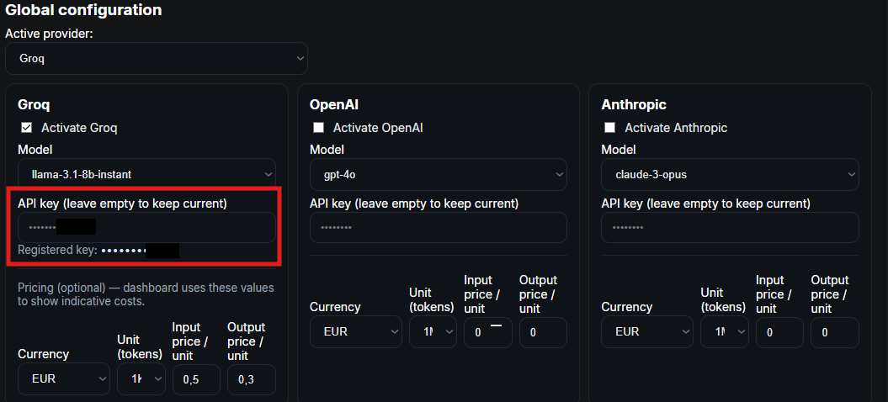

# 📖 Velixa – Guide d'installation / Installation Guide

---

## 🇫🇷 Partie Française

### 0) Introduction
Velixa est une solution **open-source** conçue comme un **proxy de gouvernance IA**.  
Elle agit comme un filtre de conformité et de sécurité entre les **utilisateurs** (humains), les **bots/agents IA** et les **services d’IA** (internes ou externes).  

Points clés :
- ✅ Conformité : RGPD, NIS 2, ISO 27001, HIPAA, confidentialité industrielle  
- ✅ Analyse contextuelle via **Phi-3-mini** *(pré-filtrage local uniquement)*  
- ✅ Règles métiers dynamiques (santé, finance, IT, éducation, etc.)  
- ✅ Support IA externes : OpenAI, Azure, Anthropic… (via API key)  
- ✅ Administration web simple (JSON, pas de SQL)  
- ✅ Journalisation complète + export CSV/PDF  
- ✅ Connecteurs AD/LDAP (prototype codé)  
- ✅ Connecteurs SIEM/SOC (pipeline présent, pas encore finalisé)  
- ✅ Déploiement simple : copier dans `htdocs`, activer HTTPS  

---

### 1) Prérequis
- **Windows** : XAMPP (Apache + PHP ≥ 8.0)  
- **Linux/Mac** : Apache2/Nginx + PHP ≥ 8.0  
- PHP : activer `curl`, `mbstring`, `zip` dans `php.ini`  
- **mkcert** (ou Let’s Encrypt) pour certificats HTTPS  
- **Ollama** pour IA locale (pré-filtrage Phi-3-mini)  
- **Composer** (si besoin d’installer `dompdf` pour PDF)  

---

### 2) Installation
1. Copier le dossier `resix/` dans `C:\xampp\htdocs\`  
2. Vérifier la structure :  
   resix/  
   ├── index.php  
   ├── login.php  
   ├── dashboard.php  
   ├── manage_users.php  
   ├── audit_admin.php  
   ├── app_https_guard.php  
   ├── rules_by_metier.json  
   ├── INTEGRITY_MANIFEST.json  
   ├── exports/  
   ├── assets/  
   └── .htaccess  

---

### 3) Configuration HTTPS
#### 3.1 Activer SSL dans Apache
Dans `httpd.conf` :  
LoadModule ssl_module modules/mod_ssl.so  
Include conf/extra/httpd-ssl.conf  

#### 3.2 Générer certificat auto-signé
winget install FiloSottile.mkcert
mkcert -install  
mkcert localhost 127.0.0.1 ::1  

Placer les fichiers générés (les fichiers se trouvent dans le dossier où la commande a été lancée ) (renommer les fichiers si besoin) :  
C:\xampp\apache\conf\ssl.crt\resix.crt  
C:\xampp\apache\conf\ssl.key\resix.key  

#### 3.3 Configurer VirtualHost
Dans `httpd-ssl.conf` :  
<VirtualHost *:443>  
    ServerName localhost  
    DocumentRoot "C:/xampp/htdocs/resix"  

    SSLEngine on  
    SSLCertificateFile "C:/xampp/apache/conf/ssl.crt/resix.crt"  
    SSLCertificateKeyFile "C:/xampp/apache/conf/ssl.key/resix.key"  

    <Directory "C:/xampp/htdocs/resix">  
        AllowOverride All  
        Require all granted  
    </Directory>  
</VirtualHost>  

#### 3.4 Vérification
- Démarrer le serveur Apache
- Navigateur → `https://localhost/resix/index.php` → cliquer sur accepter le risque et continuer : (certificat ssl configuré mais venant d'une source non-officielle, auto-signé)  
- CLI : `curl -I https://localhost/resix/index.php`  

---

### 4) Connexion administrateur
- URL : `https://localhost/resix/index.php`  
- Identifiants par défaut :  
  - **Login** : admin  
  - **Mot de passe** : Administrateur@1

⚠️ Changez immédiatement ce mot de passe comme indiqué et activer la MFA (cela se fait automatiquement à la première connexion) 

---

### 5) Gestion utilisateurs
Depuis l’interface admin (`dashboard.php`) :
- Créer, modifier, supprimer utilisateurs  
- Assigner rôle :  
  - **admin** : accès complet  
  - **user** : accès restreint  
  - **métier** : applique les règles du domaine (finance, IT, santé, etc.)  

---

### 6) Gestion des règles métiers
Fichier `rules_by_metier.json` :  
{  
  "finance": {  
    "allow_external": false,  
    "filters": ["iban", "account_number"],  
    "logging": "full"  
  },  
  "health": {  
    "allow_external": true,  
    "filters": ["medical_record", "patient_name"],  
    "logging": "anonymized"  
  }  
}  

- `allow_external` : autoriser ou non les appels API externes  
- `filters` : regex ou mots-clés interdits  
- `logging` : niveau de journalisation  

---

### 7) Connexion aux IA
#### 7.1 IA externes
Configurer `config_api.json` :  
{  
  "provider": "openai",  
  "api_key": "VOTRE_CLE_API",  
  "base_url": "https://api.openai.com/v1/"  
}  
Exemple : Après avoir généré la clé API Groq suiver les étapes des image ci-dessous:
 

#### 7.2 IA locale (Phi-3-mini)
⚠️ Phi-3-mini est utilisée **uniquement pour l’analyse contextuelle préalable**.  

Installation :  
ollama pull phi3:mini  

Configuration :  
{  
  "provider": "ollama",  
  "model": "phi3:mini",  
  "base_url": "http://localhost:11434"  
}  

Flux complet :  
1. Prompt utilisateur →  
2. Regex basiques →  
3. Analyse contextuelle Phi-3-mini (pré-filtrage) →  
4. Application règles métier →  
5. Routage IA externe (si conforme).  

---

### 8) Bots & Agents IA
#### Statut actuel
- **HMAC** : fonctionnel  
- **API Key, OAuth2, Slack/Teams, Email** : codés mais à tester  

#### Champs communs
- **Enabled** : actif ou non  
- **Name** : nom du bot  
- **Type** : HTTP, SMTP, IMAP, Chat…  
- **Mode** : Ingress / Egress / Both  
- **Auth** : HMAC / API Key / OAuth2  
- **Shared Secret**, **Signature Header**  
- **Rate limit** : ex. 30 req/min  
- **Logging** : minimal ou complet  

#### URL Ingress auto-générée
https://<serveur>/resix/api/ingress.php?bot_id=<ID>  

---

### 9) Intégration AD/LDAP
⚠️ Fonction codée mais non testée → nécessite amélioration.  

Champs à remplir :  
- Directory Type : Active Directory / OpenLDAP  
- Host : `dc01.contoso.local`  
- Port : 389/636  
- Encryption : StartTLS / LDAPS  
- Bind DN : compte de service  
- Bind Password : mot de passe service  
- Base DN : `DC=contoso,DC=local`  
- User Filter : `(&(objectClass=user)(sAMAccountName={username}))`  
- Mapping : sAMAccountName, mail, displayName, memberOf  
- OU → métier : correspondance organisationnelle  
- Multi-OU : signalement + choix admin  
- Mode : JIT (connexion en temps réel) ou Batch (import planifié)  

---

### 10) Journalisation & Audit
Localisation :  
- Fichier : `resix/logs.csv`  
- Interface : `audit_admin.php`  

Colonnes : Timestamp, Utilisateur/Bot, Métier, Règle appliquée, Action (Allow/Deny), Hash SHA-256 du prompt  

Exports :  
- PDF : `export_pdf.php`  
- CSV : `export_csv.php`  

---

### 11) Sécurité & chiffrement
- HTTPS obligatoire (redirection forcée)  
- Cookies sécurisés (Secure, HttpOnly, SameSite=Lax)  
- Logs anonymisés via hash SHA-256  
- Headers activés : HSTS, nosniff, Referrer-Policy  
- Vérification d’intégrité : `INTEGRITY_MANIFEST.json`  

---

### 12) Fonctionnalités non finalisées
- AD/LDAP : instable → à tester/améliorer  
- Bots API Key / OAuth2 : présents mais à valider  
- Connecteurs SOC/SIEM : pipeline codé, non activé  

---

### 13) Vérification finale
- Navigateur → cadenas 🔒  
- CLI → `curl -I https://localhost/resix/index.php`  
- Vérifier `INTEGRITY_MANIFEST.json`  

---

### 14) Checklist déploiement
✅ HTTPS activé  
✅ Admin `dom/dom` changé  
✅ API key configurée  
✅ Phi-3-mini actif (pré-filtrage contextuel uniquement)  
✅ IA externe routée correctement  
✅ Bots/agents testés  
✅ AD/LDAP configuré si besoin  
✅ Logs exportables et hashés  
✅ Vérification certificat OK  

---

## 🇬🇧 English Section

### 0) Introduction
Velixa is an **open-source solution** designed as an **AI governance proxy**.  
It acts as a compliance and security filter between **users** (humans), **AI bots/agents**, and **AI services** (local or external).  

Key features:
- ✅ Compliance: GDPR, NIS 2, ISO 27001, HIPAA, industrial secrecy  
- ✅ Contextual analysis via **Phi-3-mini** *(local pre-filter only)*  
- ✅ Business rules by domain (healthcare, finance, IT, education, etc.)  
- ✅ External AI support: OpenAI, Azure, Anthropic (via API key)  
- ✅ Simple web admin (JSON, no SQL)  
- ✅ Full logging + CSV/PDF exports  
- ✅ AD/LDAP connector (prototype coded)  
- ✅ SIEM/SOC connectors (pipeline coded, not finalized)  
- ✅ Simple deployment: copy to `htdocs`, enable HTTPS  

---

### 1) Requirements
- **Windows**: XAMPP (Apache + PHP ≥ 8.0)  
- **Linux/Mac**: Apache2/Nginx + PHP ≥ 8.0)  
- PHP extensions: `curl`, `mbstring`, `zip`  
- **mkcert** (or Let’s Encrypt) for HTTPS certificates  
- **Ollama** for local AI (Phi-3-mini)  
- **Composer** if you need `dompdf` for PDF exports  

---

### 2) Installation
Copy `resix/` into `C:\xampp\htdocs\`  
Verify structure same as FR section  

---

### 3) HTTPS Configuration
Enable SSL in `httpd.conf`, generate certs with mkcert, configure `httpd-ssl.conf`, restart Apache, verify via browser and curl.  

---

### 4) Admin Login
- URL: `https://localhost/resix/index.php`  
- Default: login `admin`, password `administrateur@1`  
- ⚠️ Change immediately.  And activate MFA

---

### 5) User Management
Same as FR section.  

---

### 6) Business Rules
File `rules_by_metier.json`, fields: allow_external, filters, logging.  

---

### 7) AI Configuration
- External: set provider/api_key/base_url in `config_api.json`  
- Local: Phi-3-mini only for contextual analysis, installed with `ollama pull phi3:mini`  

---

### 8) Bots & Agents
HMAC functional, others coded but untested. Fields: Enabled, Name, Type, Mode, Auth, Shared Secret, Signature Header, Rate limit, Logging.  

---

### 9) AD/LDAP
Coded but untested. Fields: Directory type, Host, Port, Encryption, Bind DN, Bind password, Base DN, User Filter, Mapping, OU mapping, Multi-OU, Mode (JIT/Batch).  

---

### 10) Logs & Audit
File: `resix/logs.csv`, Interface: `audit_admin.php`, Exports: `export_pdf.php`, `export_csv.php`.  

---

### 11) Security & Encryption
HTTPS enforced, Secure cookies, Logs anonymized (SHA-256), Security headers (HSTS, nosniff, Referrer-Policy), File integrity: `INTEGRITY_MANIFEST.json`.  

---

### 12) Non-finalized Features
AD/LDAP unstable, Bots API Key/OAuth2 coded but untested, SOC/SIEM pipeline not finalized.  

---

### 13) Final Verification
Browser lock, curl test, integrity manifest.  

---

### 14) Deployment Checklist
✅ HTTPS active  
✅ Admin `dom/dom` changed  
✅ API key configured  
✅ Phi-3-mini active (contextual analysis only)  
✅ External AI routed correctly  
✅ Bots/agents tested  
✅ AD/LDAP configured if needed  
✅ Logs exportable and hashed  
✅ HTTPS certificate valid  
